# 5:07 Trait-Approach to Personality

!!! abstract "Section Overview"
    The Trait approach to personality attempts to identify and list basic personality traits, positioning individuals on scales for each trait. This section covers the meaning of traits, **Cattell's 16 Personality Factors**, **Eysenck's Type cum Trait approach**, and the characteristics of **Extroverts and Introverts**.

---

## 5:07:1 Meaning of the Term 'Trait'

!!! quote "Definition"
    A **personality trait** is an **enduring and consistent characteristic** of a person that is observed in a **wide variety of situations**.

### Examples of Personality Traits

| Category | Trait Examples |
|----------|----------------|
| **Cognitive** | Intelligence |
| **Emotional** | Emotional sensitivity, Irritability |
| **Social** | Warm, Ascendence, Submission |

---

## 5:07:2 Cattell's Trait Approach to Personality

!!! info "Cattell's 16 Personality Factors"
    **Cattell** has identified **12 independent** and **4 secondary traits** (total **16 personality factors**) that describe the complete personality of an individual. These are **bipolar** (referring to opposite or extreme degrees).

### The 16 Personality Factors (Bipolar Traits)

| # | Trait Pole A | ↔ | Trait Pole B |
|---|--------------|---|--------------|
| 1 | **Genial** | ↔ | **Hostile** |
| 2 | **Intelligence** | ↔ | **Stupid** |
| 3 | **Emotionally stable** | ↔ | **Changeable** |
| 4 | **Dominant** | ↔ | **Submissive** |
| 5 | **Cheerful** | ↔ | **Unhappy** |
| 6 | **Sensitive** | ↔ | **Hard boiled** |
| 7 | **Thoughtful and Aesthetic** | ↔ | **Boorish and Coarse** |
| 8 | **Conscientious** | ↔ | **Slipshod** |
| 9 | **Cooperative** | ↔ | **Reserved** |
| 10 | **Vigorous** | ↔ | **Slack** |
| 11 | **Hypersensitive** | ↔ | **Phlegmatic** |
| 12 | **Friendly** | ↔ | **Suspicious** |

```mermaid
flowchart TB
    subgraph CATTELL["📊 Cattell's Classification"]
        subgraph SOURCE["Source Traits (16 PF)"]
            A[Deep, underlying traits]
            B[12 Independent + 4 Secondary]
        end
        
        subgraph SURFACE["Surface Traits"]
            C[Easily observable]
            D[External manifestations]
        end
    end
    
    SOURCE --> SURFACE
    
    style SOURCE fill:#e3f2fd,stroke:#2196f3,stroke-width:2px
    style SURFACE fill:#fff3e0,stroke:#ff9800
```

### Source Traits vs. Surface Traits

!!! note "Key Points 📌"
    Cattell named these 16 personality traits as **'Source traits'**, differentiating them from **'Surface traits'**:
    
    - **Surface traits** are **easily observable**
    - **Source traits** represent a **deeper unity** than that revealed by surface traits
    - Source traits are the **real traits** underlying personality

| Trait Type | Characteristics | Example |
|------------|-----------------|---------|
| **Source Traits** | Deep, underlying, real traits | The 16 PF factors |
| **Surface Traits** | Easily observable, external | Behaviors we see daily |

---

## 5:07:3 Eysenck's Type cum Trait Approach to Personality

!!! info "Hierarchical Model"
    **Eysenck** provides a **hierarchical type approach** to personality combining **both the type and trait approaches**.

### Three Basic Categories (Top of Hierarchy)

```mermaid
flowchart TB
    subgraph EYSENCK["🔺 Eysenck's Hierarchical Model"]
        subgraph TOP["Type Level"]
            A["Extroversion ↔ Introversion"]
            B["Neuroticism ↔ Stability"]
            C["Psychotism ↔ Normality"]
        end
        
        subgraph REDUCED["Reduced to Two Dimensions"]
            D["Stable ↔ Unstable"]
            E["Introversion ↔ Extroversion"]
        end
    end
    
    TOP --> REDUCED
    
    style TOP fill:#ffcdd2,stroke:#f44336,stroke-width:2px
    style REDUCED fill:#c8e6c9,stroke:#4caf50
```

### Eysenck's Hierarchical Structure

| Level | Description | Example |
|-------|-------------|---------|
| **Type Level** | Basic personality categories | Extroversion-Introversion |
| **Trait Level** | Qualities within each type | Persistence, Rigidity, Subjectivity |
| **Habitual Response Level** | General behavioral tendencies | Persistent in problem-solving |
| **Specific Response Level** | Specific task behaviors | Traits expressed in diverse degrees |

---

## 5:07:3:01 Characteristics of 'Extroverts' and 'Introverts'

### Extrovert Characteristics

!!! note "Extrovert Profile"
    Extroverts are described by Eysenck as:

| Characteristic | Description |
|----------------|-------------|
| **Outgoing** | Socially oriented |
| **Relatively uninhibited** | Free in expression |
| **Fond of social activities** | Enjoy activities with people |
| **Not attracted to solitary pursuits** | Dislike study alone |
| **Crave excitement** | Seek stimulation |
| **Aggressive** | Assertive behavior |
| **Unreliable** | Less consistent |
| **Easy going** | Relaxed attitude |
| **Optimistic** | Positive outlook |

### Introvert Characteristics

!!! note "Introvert Profile"
    Introverts have the **opposite traits**:

| Characteristic | Description |
|----------------|-------------|
| **Inward** | Internally focused |
| **Highly reserved** | Restrained in expression |
| **Shy** | Socially reticent |
| **Like to be aloof** | Prefer distance |
| **Attracted to solitary pursuits** | Enjoy study alone |
| **Rigid** | Inflexible |
| **Highly reliable** | Consistent and dependable |
| **Persistent** | Continues despite difficulties |
| **Realistic** | Practical outlook |

### Comparison Table

| Feature | Extrovert | Introvert |
|---------|-----------|-----------|
| **Social Orientation** | Outgoing, social | Reserved, aloof |
| **Inhibition** | Uninhibited | Shy |
| **Activity Preference** | Social activities | Solitary pursuits (study) |
| **Excitement** | Craves excitement | Avoids overstimulation |
| **Emotional Expression** | Aggressive, easy going | Rigid |
| **Reliability** | Unreliable | Highly reliable |
| **Attitude** | Optimistic | Realistic |
| **Persistence** | Less persistent | Persistent |

!!! tip "Exam Tip 📝"
    **Eysenck's research findings lend support** to the existence of extroverts and introverts, validating Jung's earlier type classification.

---

## 5:07:4 Merits and Limitations of Trait Approach

### 5:07:4:01 Usefulness of Trait Approach (Merits)

!!! success "Merits"
    
    **i) Selection and Placement**
    Trait ratings are useful in the **selection and placement** of persons in courses, jobs, etc.
    
    **ii) Cumulative Records and Guidance**
    Any cumulative record listing important personality traits is of value in:
    
    - **Academic evaluation**
    - **Educational guidance**
    - **Vocational guidance**

| Application | Use of Trait Approach |
|-------------|----------------------|
| **Job Selection** | Rating candidates on required traits |
| **Course Placement** | Matching personality to course demands |
| **Academic Records** | Tracking personality development |
| **Career Guidance** | Matching traits to professions |

---

### 5:07:4:02 Limitations of Trait Approach

!!! warning "Limitations"
    
    **1) No Description of Trait Organisation**
    It does not describe **how the traits are organised (or coordinated)** within the individual.
    
    **2) Ignores Trait Interactions and Situations**
    There may be **interaction of different types of traits** and further any trait has to be appraised according to a **range of situations and circumstances**. These are not accounted for in the trait approach.

!!! example "Example of Limitation"
    Boys rated high in **"aggressiveness"** were **not found aggressive under all types of provocations**.

| Limitation | Explanation |
|------------|-------------|
| **Lacks Organisation** | Doesn't show how traits work together |
| **Ignores Interactions** | Traits may affect each other |
| **Context-Blind** | Same trait may manifest differently in different situations |

---

## 📊 Comparison: Type vs. Trait Approach

| Aspect | Type Approach | Trait Approach |
|--------|---------------|----------------|
| **Method** | Categorizes into types | Rates on multiple traits |
| **Flexibility** | Rigid categories | Continuous scales |
| **Complexity** | Simple (few types) | Complex (many traits) |
| **Individuality** | Limited | Better captured |
| **Limitation** | People don't fit types | Ignores trait organization |

---

!!! tip "Exam Tip 📝"
    **Key Points to Remember:**
    
    1. **Cattell** = 16 PF (Source vs. Surface traits)
    2. **Eysenck** = Hierarchical (Type → Trait → Habitual → Specific)
    3. **Eysenck's dimensions** = E-I, N-S, P-N → Reduced to 2 (Stable-Unstable, E-I)
    4. **Merits** = Selection, Placement, Guidance
    5. **Limitations** = No organisation, No interaction, Context-blind

---

!!! success "Summary"
    The **Trait Approach**:
    
    - Defines traits as **enduring, consistent characteristics**
    - **Cattell** identified **16 personality factors** (source vs. surface traits)
    - **Eysenck** created a **hierarchical model** (Type → Trait → Habitual → Specific)
    - **Extroverts** are outgoing, uninhibited, optimistic
    - **Introverts** are reserved, shy, reliable, persistent
    - **Useful** for selection, placement, and guidance
    - **Limited** by ignoring trait organisation and situational factors

---

> **Bridge →** While Type and Trait approaches describe personality structure, Freud's Psychoanalytic theory explains personality dynamics and development. Let's explore this in Section 5:08.

---

## ❓ Review Questions

1. Define 'personality trait' **(C)** [Ans. 5:07:1]
2. Briefly explain Cattell's trait-approach in studying personality **(B)** [Ans. 5:07:2]
3. Describe Eysenck's type cum trait approach in studying personality **(B)** [Ans. 5:07:3]
