# 5:08 Freud's Psycho-analytic Theory of Personality

!!! abstract "Section Overview"
    **Sigmund Freud's** psycho-analytic theory explains personality through the structure of the mind (Id, Ego, Super-Ego) and the levels of consciousness (Conscious, Unconscious, Preconscious). This section also covers the **Freudian stages of personality development**: Oral, Anal, Phallic, Latency, and Genital stages.

---

## 📊 Two Fundamental Principles

Freud's theory of personality is based on **two fundamental principles**:

```mermaid
flowchart TB
    subgraph PRINCIPLES["🧠 Freud's Two Fundamental Principles"]
        A["i) Structure of Personality<br>(Id, Ego, Super-Ego)"]
        B["ii) Levels of Mind<br>(Conscious, Unconscious, Preconscious)"]
    end
    
    style PRINCIPLES fill:#e3f2fd,stroke:#2196f3,stroke-width:2px
```

---

## Principle I: Structure of Personality

!!! note "Key Points 📌"
    The structure of personality consists of **three components** which function **independently** and at the same time **affect each other** by their mutual interactions.

### The Three Components

| Component | Alternative Name | Function |
|-----------|------------------|----------|
| **Id** | Unconscious mind | Primitive desires and instincts |
| **Ego** | Conscious mind (Self) | Mediates between Id and Super-Ego |
| **Super-Ego** | Moral conscience | Parental and societal standards |

---

## Principle II: Levels of Mind

!!! note "Key Points 📌"
    Human mind operates at **three levels**:

```mermaid
flowchart TB
    subgraph LEVELS["🧠 Levels of Mind"]
        direction TB
        A["(a) Conscious"]
        B["(c) Preconscious / Sub-conscious"]
        C["(b) Unconscious"]
    end
    
    A --- B --- C
    
    style A fill:#c8e6c9,stroke:#4caf50
    style B fill:#fff3e0,stroke:#ff9800
    style C fill:#ffcdd2,stroke:#f44336
```

| Level | Position | Description |
|-------|----------|-------------|
| **(a) Conscious** | Surface | Immediate awareness |
| **(c) Preconscious** | Middle | Between conscious and unconscious |
| **(b) Unconscious** | Deep | Hidden desires and memories |

---

## 📖 Detailed Explanation of Id, Ego, and Super-Ego

### 1. Id (The Unconscious)

!!! quote "Definition"
    **Id** is the inborn reservoir of primitive psychic energy called **'Libido'** which is completely unconscious and demands **immediate satisfaction** of its unfulfilled desires (mostly sexual in nature) and instincts, on the basis of what is known as **'pleasure principle'** regardless of external reality.

| Aspect | Description |
|--------|-------------|
| **Nature** | Completely unconscious |
| **Energy** | Libido (primitive psychic energy) |
| **Principle** | Pleasure principle |
| **Demands** | Immediate gratification |
| **Origin** | Inborn (original source of personality) |

#### Id Instincts

!!! info "Life and Death Instincts"
    All the energy of human behaviour is provided by **inborn Id instincts**:
    
    | Instinct Type | Name | Drive |
    |---------------|------|-------|
    | **Life Instincts** | Eros | Sex |
    | **Death Instincts** | Thanatos | Aggression |

!!! note "Key Points 📌"
    - **Id is the original source** of personality from which Ego and Super-Ego develop
    - Personality is moulded by how a person attempts to **resolve conflicts** between Id's demands and **social constraints**

---

### 2. Ego (The Self)

!!! quote "Definition"
    **Ego** develops out of the Id because of the need of dealing with the **real world** around the individual. It corresponds to the **'self'** and represents **reason** in keeping the demands of the Id in check.

| Aspect | Description |
|--------|-------------|
| **Origin** | Develops from Id |
| **Function** | Deals with real world |
| **Represents** | Self and reason |
| **Role** | Mediates between Id and Super-Ego |
| **Status** | Executive agency of personality |

!!! note "Key Points 📌"
    Ego is the **executive agency of personality**, deciding **what actions are appropriate**.

---

### 3. Super-Ego (The Conscience)

!!! quote "Definition"
    **Super-Ego** is the system developed in the individual by incorporating **parental standards** and the **moral standards of the society** as perceived by the ego. It is the internalised representation of social and moral values and most nearly corresponds to what is known as **'conscience'**.

| Aspect | Description |
|--------|-------------|
| **Origin** | Developed through socialization |
| **Content** | Parental and societal moral standards |
| **Function** | Moral guidance |
| **Represents** | Conscience |
| **Nature** | Internalised social values |

---

## ⚖️ The Balance of Personality

!!! info "Freud's Arena Analogy"
    According to Freud, personality is a kind of an **arena** in which:
    
    - **What the person wants to do** (instinct - Id)
    - **Conflicts with what he has learnt he should do** (morality - Super-Ego)
    - **Where a reconciliation is made and compromise arrived at** (by Ego)

```mermaid
flowchart TB
    subgraph BALANCE["⚖️ Personality Balance"]
        A[Id: What I WANT to do]
        B[Super-Ego: What I SHOULD do]
        C[Ego: What I WILL do]
    end
    
    A --> C
    B --> C
    C --> D[Personality Outcome]
    
    style C fill:#fff3e0,stroke:#ff9800,stroke-width:2px
```

---

## 🎯 Two Personality Outcomes

### i) Healthy Personality (Strong Ego)

!!! success "Strong Ego"
    Those who have a **strong Ego** which succeeds in balancing the Id and Super-Ego will have a **healthy and balanced personality**.

### ii) Maladjusted Personality (Weak Ego)

!!! warning "Weak Ego"
    If a person has a **weak Ego** which struggles to balance the Id and Super-Ego, then **tension and conflicts** occur frequently which are often managed by adopting **'defense mechanisms'**.

!!! danger "Warning Sign"
    **Frequent use of defense mechanisms** itself indicates the danger of the onset of **maladjustment** in the person.

### Types of Maladjustment

| Condition | Dominance | Result |
|-----------|-----------|--------|
| **Super-Ego > Id** | Super-Ego powerful | Unconscious desires suppressed → **Neurotic behaviour** |
| **Id > Ego** | Id dominant | Unlawful activities → **Delinquent behaviour** |

```mermaid
flowchart TB
    subgraph OUTCOMES["🎯 Personality Outcomes"]
        A[Strong Ego] --> B[Healthy & Balanced Personality]
        C[Weak Ego] --> D[Defense Mechanisms]
        D --> E[Maladjustment]
        
        subgraph MALADJUST["Types of Maladjustment"]
            F[Super-Ego > Id → Neurotic Behaviour]
            G[Id > Ego → Delinquent Behaviour]
        end
    end
    
    E --> MALADJUST
    
    style B fill:#c8e6c9,stroke:#4caf50
    style E fill:#ffcdd2,stroke:#f44336
```

---

## 🧬 Role of Sex Instinct

!!! note "Key Points 📌"
    Freud emphasized the importance of the **fulfilment of the sex instinct**:
    
    - Freud considered **sex as life energy**
    - Fulfilment of sex instinct is one of the **primary needs** of man
    - **How far one's sex instinct is satisfied** determines the status of personality development
    - By knowing one's behaviour expressive of sex instinct's satisfaction, we can judge at **what stage of personality development** he is at

---

# 5:08:1 Freudian Stages of Personality Development

!!! info "Psychosexual Development"
    Freud postulated that since birth an individual passes through **four stages of psychosexual development** (plus a latency period).

---

## Stage 1: Oral Stage (First Year of Life)

| Aspect | Description |
|--------|-------------|
| **Age** | 0-1 year |
| **Pleasure Centre** | Mouth |
| **Activities** | Sucking, biting, etc. |
| **Fixation Issues** | Oral dependency |

---

## Stage 2: Anal Stage (2-3 Years)

| Aspect | Description |
|--------|-------------|
| **Age** | 2nd and 3rd year |
| **Pleasure Centre** | Anal region |
| **Key Event** | Toilet training period |
| **Fixation Issues** | If anxieties felt due to toilet training → **Anal syndrome** (excessive conformity and compulsiveness) |

---

## Stage 3: Phallic Stage (4-5 Years)

| Aspect | Description |
|--------|-------------|
| **Age** | Between 4 and 5 years |
| **Pleasure Centre** | Genitals |
| **Key Developments** | Sex role learning, identification with same-sex parent |

### Oedipus and Electra Complex

| Complex | Child | Love Object | Rival | Learning Outcome |
|---------|-------|-------------|-------|------------------|
| **Oedipus Complex** | Boy | Mother | Father | Imitates father to win mother's love → learns sex role |
| **Electra Complex** | Girl | Father | Mother | Develops desire for father |

!!! warning "Fixation Issues"
    Difficulties in development during this stage may lead to **various forms of sex deviations**.

---

## Stage 4: Latency Period (6 Years to Puberty)

| Aspect | Description |
|--------|-------------|
| **Age** | After phallic stage until puberty |
| **Characteristic** | **Dormancy** - lack of interest in sex |
| **Activity Focus** | School, peers, intellectual development |

---

## Stage 5: Genital Stage (Puberty to Adulthood)

| Aspect | Description |
|--------|-------------|
| **Age** | Puberty and adolescence → adult years |
| **Markers** | Physical and sexual maturity |
| **Pleasure Centre** | Genitals (mature form) |
| **Goal** | Establish **stable, long-term sexual relationships** |

---

## 📊 Complete Stages Summary Table

| Stage | Age | Pleasure Zone | Key Event/Activity | Fixation Result |
|-------|-----|---------------|-------------------|-----------------|
| **Oral** | 0-1 year | Mouth | Sucking, biting | Oral dependency |
| **Anal** | 2-3 years | Anal region | Toilet training | Anal syndrome (conformity, compulsiveness) |
| **Phallic** | 4-5 years | Genitals | Oedipus/Electra complex | Sex deviations |
| **Latency** | 6-puberty | None (dormant) | School, peers | -- |
| **Genital** | Puberty-adult | Genitals | Sexual maturity | Stable relationships |

---

!!! tip "Exam Tip 📝"
    **Memory Aid for Stages: "OAPLEG"**
    
    - **O**ral (0-1)
    - **A**nal (2-3)
    - **P**hallic (4-5) + **L**atency (6-puberty)
    - **G**enital (puberty onwards)
    
    **Memory Aid for Structure: "I-E-S"**
    
    - **I**d = Pleasure principle, Instincts, Immediate gratification
    - **E**go = Executive, External reality, Equilibrium
    - **S**uper-Ego = Social standards, Should, Conscience

---

!!! success "Summary"
    **Freud's Psycho-analytic Theory**:
    
    1. **Structure**: Id (unconscious desires) + Ego (self/mediator) + Super-Ego (conscience)
    2. **Levels**: Conscious, Preconscious, Unconscious
    3. **Key Concepts**: Libido, Pleasure Principle, Defense Mechanisms
    4. **Stages**: Oral → Anal → Phallic → Latency → Genital
    5. **Healthy Personality**: Strong Ego balancing Id and Super-Ego
    6. **Maladjustment**: Neurotic (Super-Ego dominant) or Delinquent (Id dominant)

---

> **Bridge →** Freud's theory explains personality dynamics, but what constitutes an ideal, well-functioning personality? Let's explore the concept of Integrated Personality in Section 5:09.

---

## ❓ Review Questions

1. Explain Freud's Psycho-analytic Theory of Personality and its various stages. **(A)** [Ans. 5:08 + 5:08:1]
