# 5:09 Integrated Personality

!!! abstract "Section Overview"
    An **integrated personality** represents the ideal state of psychological health. This section explores the concept of integrated personality, which is synonymous with self-actualized, emotionally mature, and well-adjusted personality. It covers the five aspects of harmony and the characteristics identified by **Skinner** and **Allport**.

---

## 📖 Understanding Integrated Personality

!!! quote "Definition"
    **Self-actualised personality**, **emotionally and socially mature individual**, **well-adjusted personality**, and **integrated personality** are all almost **synonymous**.

```mermaid
flowchart TB
    subgraph SYNONYMS["🎯 Synonymous Terms"]
        A[Self-actualised Personality]
        B[Emotionally Mature Individual]
        C[Socially Mature Individual]
        D[Well-adjusted Personality]
        E[Integrated Personality]
    end
    
    A & B & C & D --> E
    
    style E fill:#c8e6c9,stroke:#4caf50,stroke-width:2px
```

---

## 🔑 Key Characteristics of an Integrated Person

| Characteristic | Description |
|----------------|-------------|
| **Realistic Self-Assessment** | Has realistic assessment of himself, his strength and weakness |
| **Stable Self-Concept** | Has a stable self-concept with higher level of self-esteem |
| **Fewer Inadequacy Feelings** | Has fewer feelings of inadequacy |
| **Less Compensatory Behaviour** | Shows fewer evidences of compensatory behaviour |
| **Self-Acceptance** | Accepts himself, leading to being accepted by others |

---

## ⚖️ Five Aspects of Harmony

!!! note "Key Points 📌"
    **Integrated personality implies harmony between five important aspects of personality:**

```mermaid
flowchart TB
    subgraph HARMONY["⚖️ Five Aspects of Harmony"]
        A["1. Harmony between<br>Abilities and Capabilities"]
        B["2. Harmony among<br>One's Interests"]
        C["3. Harmony between<br>Abilities and Interests"]
        D["4. Harmony between<br>Self-concept and Social Constraints"]
        E["5. Harmony between<br>Life Goals and Social Codes"]
    end
    
    style HARMONY fill:#e3f2fd,stroke:#2196f3,stroke-width:2px
```

### Detailed Explanation

| # | Harmony Between | Description |
|---|-----------------|-------------|
| 1 | **Abilities and Capabilities** | What one can do matches what one is capable of |
| 2 | **One's Interests** | Different interests don't conflict |
| 3 | **Abilities and Interests** | What one can do aligns with what one wants to do |
| 4 | **Self-concept and Social Constraints** | Self-perception aligns with social expectations |
| 5 | **Life Goals and Social Codes** | Personal ambitions align with societal norms |

---

## 📚 Skinner's Characteristics of Integrated Personality

According to **Skinner**, the characteristics of an integrated personality are:

### 1. Harmonious Development

!!! note "First Characteristic"
    **Harmonious development of thoughts, feelings and intentions** to:
    
    - Activity
    - Affection
    - Sympathy
    - A desire to cooperate with others

```mermaid
flowchart TB
    subgraph SKINNER1["🧠 Harmonious Development"]
        subgraph INTERNAL["Internal Aspects"]
            A[Thoughts]
            B[Feelings]
            C[Intentions]
        end
        
        subgraph EXTERNAL["Leading to"]
            D[Activity]
            E[Affection]
            F[Sympathy]
            G[Cooperation]
        end
    end
    
    A & B & C --> D & E & F & G
    
    style SKINNER1 fill:#fff3e0,stroke:#ff9800
```

### 2. Balanced Self-Awareness

!!! note "Second Characteristic"
    **Confidence in one's abilities** as well as **awareness of one's weakness**

| Aspect | Description |
|--------|-------------|
| **Confidence** | Belief in one's abilities |
| **Awareness** | Recognition of limitations |
| **Balance** | Neither overconfident nor underconfident |

---

## 📚 Allport's Two Important Characteristics

According to **Allport**, an individual with integrated personality will have **two important characteristics**:

### i) Self Extension

!!! quote "Definition"
    **Self Extension** means to have **clear life values** and believe them personally and be **involved in such values**.

| Aspect | Description |
|--------|-------------|
| **Clear Values** | Defined personal beliefs |
| **Personal Belief** | Genuinely holding these values |
| **Involvement** | Active engagement with values |

### ii) Self Objectification

!!! quote "Definition"
    **Self Objectification** means being able to **evaluate oneself without any bias**.

| Aspect | Description |
|--------|-------------|
| **Self-Evaluation** | Ability to assess oneself |
| **Without Bias** | Objective, not influenced by ego |
| **Accurate Self-Perception** | Realistic view of self |

### The Outcome

!!! success "Philosophy of Life"
    These two characteristics will **jointly generate a good philosophy of life**. 
    
    They believe and practise the dictum: **"Be yourself and accept yourself"**

---

## 📊 Summary: Characteristics of Integrated Personality

| Source | Key Characteristics |
|--------|---------------------|
| **General** | Realistic self-assessment, stable self-concept, self-acceptance |
| **Harmony** | Five aspects - abilities, interests, self-concept, goals |
| **Skinner** | Harmonious development; confidence with awareness |
| **Allport** | Self Extension; Self Objectification |

---

## 🔄 The Integrated Personality Model

```mermaid
flowchart TB
    subgraph MODEL["🎯 Integrated Personality Model"]
        subgraph INTERNAL["Internal Balance"]
            A[Realistic Self-Assessment]
            B[Stable Self-Concept]
            C[High Self-Esteem]
        end
        
        subgraph HARMONY["Five Harmonies"]
            D[Abilities ↔ Capabilities]
            E[Among Interests]
            F[Abilities ↔ Interests]
            G[Self ↔ Society]
            H[Goals ↔ Norms]
        end
        
        subgraph OUTCOMES["Characteristics"]
            I[Self Extension]
            J[Self Objectification]
        end
        
        subgraph RESULT["Result"]
            K[Good Philosophy of Life]
            L[Be Yourself & Accept Yourself]
        end
    end
    
    INTERNAL --> HARMONY --> OUTCOMES --> RESULT
    
    style RESULT fill:#c8e6c9,stroke:#4caf50
```

---

!!! tip "Exam Tip 📝"
    **Memory Aid for Five Harmonies: "AC-I-AI-SC-GC"**
    
    1. **A**bilities & **C**apabilities
    2. **I**nterests (among)
    3. **A**bilities & **I**nterests
    4. **S**elf-concept & Social **C**onstraints
    5. **G**oals & Social **C**odes
    
    **Allport's Two S's:**
    
    - **S**elf **E**xtension (Values)
    - **S**elf **O**bjectification (Unbiased evaluation)

---

!!! success "Summary"
    **Integrated Personality** is characterized by:
    
    1. **Realistic self-assessment** with stable self-concept
    2. **Harmony** in five areas: abilities-capabilities, interests, abilities-interests, self-society, goals-norms
    3. **Skinner's view**: Harmonious development + confidence with awareness
    4. **Allport's view**: Self Extension (clear values) + Self Objectification (unbiased self-evaluation)
    5. **Core philosophy**: "Be yourself and accept yourself"

---

> **Bridge →** Understanding what constitutes an integrated personality leads us to consider how we can assess personality. Let's explore personality assessment methods starting with Section 5:10.

---

## ❓ Review Questions

1. Write short note on: Integrated Personality **(B)** [Ans. 5:09]
