# 5:10 Personality Assessment

!!! abstract "Section Overview"
    Having explored what personality is and the theories behind it, we now turn to how it can be measured. This section introduces the field of **personality assessment**, contrasting historical pseudo-scientific methods with modern scientific techniques. It also outlines the critical principles for conducting valid personality assessments.

---

## 🕰️ Historical vs. Modern Assessment Methods

From time immemorial, attempts have been made to predict the personality pattern of individuals through various methods.

### Pseudo-scientific Techniques

These are historical methods that lack scientific validation.

```mermaid
flowchart TB
    subgraph PSEUDO["🔮 Pseudo-scientific Techniques"]
        A[Astrology]
        B[Palmistry]
        C[Physiognomy]
        D[Phrenology]
        E[Graphology]
    end
    
    style PSEUDO fill:#ffcdd2,stroke:#f44336,stroke-width:2px
```

| Technique | Description |
|-----------|-------------|
| **Astrology** | Predicting personality from celestial bodies |
| **Palmistry** | Predicting personality from lines on the palm |
| **Physiognomy** | Predicting personality from facial features |
| **Phrenology** | Predicting traits from bumps on the skull |
| **Graphology** | Handwriting analysis |

!!! warning "Critical Limitation"
    These are **pseudo-scientific techniques** and are not considered reliable or valid for personality assessment.

---

### Scientific and Objective Techniques

Modern psychology relies on scientific methods to assess personality.

!!! note "Key Points 📌"
    Scientific and objective techniques of personality development involve **collection of behaviour samples of various kinds**.

| Early Approach | Later Approach |
|----------------|----------------|
| **Type Approach** | Classifying people based on a central theme (Kretchmer, Sheldon, Spranger, Allport, Vernon) |
| **Trait Approach** | Developing personality tests and inventories to identify and scale traits (Cattell) |

---

## 📋 Principles of Scientific Personality Assessment

There are several critical principles to follow when conducting personality assessments.

### 1. Define Traits for Assessment

!!! info "First Principle"
    Generally before trying to measure personality, it is necessary to **draw up a list of personality traits** which are to form the basis of assessment.

### 2. Interpret Scores Cautiously

!!! info "Second Principle"
    Personality scores should be **cautiously interpreted** and must always be **supplemented by data from other sources**.

| Data Source | Examples |
|-------------|----------|
| **Personality Test Scores** | Scores from questionnaires, inventories |
| **Data from Other Sources** | Interviews, observation, academic records |

### 3. Require Trained Professionals

!!! info "Third Principle"
    **Only trained and experienced persons** should undertake personality tests.

| Role | Required Skill |
|------|----------------|
| **Administrator** | Training in test administration |
| **Interpreter** | Experience in score interpretation |
| **Assessor** | Clinical judgment and expertise |

---

## 📊 Summary Table: Scientific Assessment Principles

| # | Principle | Explanation |
|---|-----------|-------------|
| 1 | **Define Traits** | List the specific personality traits to be measured before starting |
| 2 | **Interpret Cautiously** | Do not rely on scores alone; use supplementary data |
| 3 | **Require Experts** | Only trained and experienced professionals should conduct tests |

---

## 🔑 Key Steps in Personality Assessment

---

!!! tip "Exam Tip 📝"
    **Remember the 3 rules of personality assessment:**
    
    1. **Define** what you're measuring (traits)
    2. **Don't rely on one source** (supplement data)
    3. **Use professionals** (trained persons)

---

!!! success "Summary"
    - Personality assessment has evolved from **pseudo-scientific methods** (astrology, palmistry) to **scientific techniques**.
    - Modern techniques involve **collecting behavior samples** and using **tests and inventories**.
    - Key principles for assessment include:
        - **Defining the traits** to be measured
        - **Interpreting scores cautiously** with supplementary data
        - Ensuring tests are conducted by **trained and experienced persons**

---

> **Bridge →** Now that we understand the principles of personality assessment, let's explore the specific approaches and methods used in Section 5:11.
