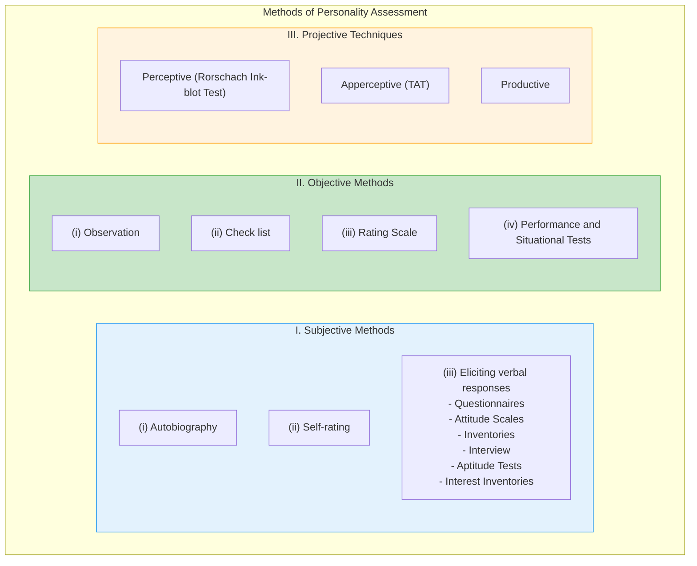
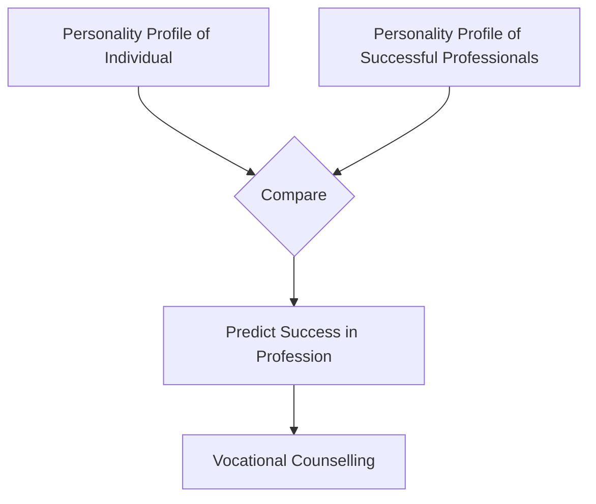

# 5:11 Approaches and Methods of Assessing Personality

!!! abstract "Section Overview"
    This section provides a detailed overview of the various methods used in personality assessment, grouped into three main categories: **Subjective Methods**, **Objective Methods**, and **Projective Techniques**. Each method is explained with its specific tools, merits, and limitations.

---

## 📊 Three Major Approaches to Assessment

Various methods employed in the assessment of personality could be grouped under **three major heads**:

### Summary Table of Assessment Methods

| Category | Methods |
|----------|---------|
| **I. Subjective Methods** | Autobiography, Self-rating, Questionnaires, Inventories, Interview, Attitude Scales, Aptitude Tests, Interest Inventories |
| **II. Objective Methods** | Observation, Check list, Rating Scale, Performance and Situational Tests |
| **III. Projective Techniques** | Perceptive (Rorschach), Apperceptive (TAT), Productive |

---

## I. Subjective Methods

### 5:11:1 Interview Method

!!! quote "Definition"
    **Interviews** involve **direct interaction** between the tester and the subject. The interviewer arrives at conclusions regarding personality traits not only from the answers to questions but also from the way the subject conducts himself during the interview.

#### Types of Interviews

| Category | Types |
|----------|-------|
| **Purpose** | Introductory, Fact finding (informative), Diagnostic, Prognostic |
| **Structure** | Structured (standard pattern), Unstructured (interviewee determines discussion) |

#### The Interview Process

| Stage | Purpose |
|-------|---------|
| **1. Beginning** | To establish rapport |
| **2. Middle** | To elicit information regarding personality traits |
| **3. End** | To terminate the interview on a cordial note |

---

#### 5:11:1:01 Limitations of Interview Method

!!! warning "Limitations"
    1. **Skill Dependent**: Interviewing is an art, and skill is not present in all to the same degree.
    2. **Subjectivity**: The problem of subjectivity is its biggest limitation.
    3. **Power Dynamics**: The interviewer may dominate or humiliate the interviewee.
    4. **Bias**: The interviewer may try to thrust his ideas on the interviewee.

---

#### 5:11:1:02 Uses of Interview

!!! success "Merits"
    1. **Versatility**: Best option to collect information from children, senior citizens, patients, illiterate persons, and very busy important persons.
    2. **Routine Activities**: Used for student admission, job placements, student counselling, occupational guidance, medical counselling, and judicial enquiry.
    3. **Research**: Used in historical studies, clinical case studies, and surveys.
    4. **Superior Information**: An ably conducted interview is superior to other forms because:
        - People talk more than they write.
        - Can clarify questions.
        - Can use cross-questions to confirm integrity.
        - Informants cannot modify previous answers.

---

### 5:11:2 Rating Scales (Objective Method)

!!! quote "Definition"
    **Ratings** are the assignment of a **numerical score** that indicates the rater's judgement of the observed individual's standing on a given personality trait.

#### 5-Point Rating Scale Example

| Rating | Score |
|--------|-------|
| Very high | +2 |
| High | +1 |
| Average | 0 |
| Low | -1 |
| Very low | -2 |

#### Types of Rating

| Type | Rater | Objectivity |
|------|-------|-------------|
| **Self-rating** | Subject rates himself | Susceptible to distortions, less objective |
| **Experimenter rating** | Someone else rates the subject | More objective and valid |

---

#### Factors Affecting Rating Reliability

!!! warning "Sources of Error"
    - **Personal bias** of the rater.
    - **Generosity error** (rating everyone near the average).
    - **Ambiguity** of the rating scale definitions.
    - **Halo effect** (rating on one trait influences rating on another unrelated trait).

#### Psychograph / Personality Profile

!!! info "Application"
    A number of rating scales for one individual can be combined into a **psychograph** or **personality profile**. By comparing this profile with those of successful people in a profession, we can provide **vocational counselling**.

---

### 5:11:3 Questionnaire (Subjective Method)

!!! quote "Definition by Good & Hatt"
    "**Questionnaire** refers to a device for securing answers to questions by using an inquiry form which the **respondent fills in himself**."

- The testee notes down answers to a series of printed questions.
- From the nature of answers, personality is judged.
- **Personality inventories** (usually in statement form) are also used.

---

#### 5:11:3:01 Model Questions

Sample questions from **Woodworth’s popular questionnaire**:

1. Do you generally sleep well? (Yes/No)
2. Was your childhood happy? (Yes/No)
3. Do you easily befriend others? (Yes/No)
4. Are you frequently troubled with feelings of inferiority? (Yes/No)
5. Do you day-dream a lot? (Yes/No)

#### Standard Questionnaires

- **Woodworth’s Personal Data Sheet**
- **Allport’s Ascendence-Submission Reaction Study**
- **Bell's Adjustment Inventory**
- **Minnesota Multiphasic Personality Inventory (MMPI)** (550 statements, 10 traits)
- **Cattell’s 16 Personality Factor (16 PF) Questionnaire** (useful in vocational guidance)

---

#### 5:11:3:02 Limitations of Questionnaire

!!! warning "Limitations"
    1. **Social Desirability**: Respondents rarely mark their real characteristics and avoid stating negative traits.
    2. **Subjectivity**: The results cannot be independently verified.
    3. **Lack of Self-Knowledge**: If the respondent doesn't know themself well, the questionnaire will lack construct validity.

---

#### 5:11:3:03 Merits of Questionnaire

!!! success "Merits"
    1. **Economical**: Can be used in various situations.
    2. **Usable by Teachers**: Can be used in classrooms without special training.
    3. **Efficient**: Can be administered to many people at once, saving time and money.

---

## III. Projective Techniques

!!! quote "Definition"
    **Projective techniques** strive to get at the **fundamental organisation of personality**. They use **ambiguous and unstructured stimuli** (inkblots, vague pictures, incomplete sentences) and ask the subject to structure them. In doing so, the subject **unknowingly projects** his own desires, hopes, fears, and repressed wishes.

### Three Types of Projective Techniques

| Type | Description | Example |
|------|-------------|---------|
| **(i) Perceptive** | Report what is perceived in the stimulus | **Rorschach Ink Blot Test** |
| **(ii) Apperceptive** | Go beyond perception and create a story | **Thematic Apperception Test (TAT)** |
| **(iii) Productive** | Rely on the subject's performance (drawing, role-playing) | Drawing tests, Psychodrama |

---

### 5:11:4:01 Salient Features of Projective Tests

!!! note "Key Features"
    1. **Unfamiliar Items**: Testees don't know how to give a "correct" answer, so responses are unique and revealing.
    2. **No Faking**: Disguised as tests of imagination, they prevent faking.
    3. **Ambiguous Stimuli**: Don't rely on learning, memory, or intellectual skills.
    4. **No Need for Elaboration**: Do not demand articulate explanations.
    5. **Holistic Interpretation**: Interpreted based on the **total configuration of responses**, not single answers.

---

### 5:11:4:02 Rorschach Ink Blot Test

Developed by **Harmann Rorschach** (Swiss psychiatrist, 1921).

- **Materials**: **10 cards** with symmetrical inkblots (5 colored, 5 black & white).
- **Procedure**: Subject is shown cards and asked "what he sees".
- **Scoring**: Based on **Location**, **Determinants**, and **Contents**.

| Scoring Category | Description | Examples (Symbols) |
|------------------|-------------|--------------------|
| **(i) Location** | Part of blot used | **W** (Whole), **D** (Large Detail), **d** (Small Detail), **S** (Space) |
| **(ii) Determinants** | Aspect directing perception | **M** (Movement), **F** (Form), **C** (Colour), **K** (Texture) |
| **(iii) Contents** | Meaning of the response | **H** (Human), **A** (Animal), **Obj** (Object), **Pl** (Plant) |

**Interpretation**:
- **Intellectual Activity**: Indicated by F, W, D.
- **Externalised Emotions**: Indicated by C, CF, K.
- **Internalised Emotional Life**: Indicated by M.

!!! warning "Limitation"
    Requires a **clinical psychologist** for administration and interpretation. Highly useful in psychiatry.

---

### 5:11:4:03 Murray Morgan's Thematic Apperception Test (T.A.T)

Developed by **Murray and Morgan**.

- **Materials**: **20 pictures** depicting vague social situations.
- **Procedure**: Subject is asked to **spin a story** for each picture (what's happening, what led to it, what will happen).
- **Interpretation**: Based on **recurring themes**, needs and frustrations of the hero, and interpersonal relations.
- **CAT**: A separate test (**Children's Apperception Test**) exists for children.

---

### 5:11:4:04 Situational Tests

!!! quote "Definition"
    A kind of **performance test** where subjects are observed in situations **without knowing they are being assessed** (tests are camouflaged).

- **Example**: An honesty test using fictitious words in a vocabulary list.
- **Limitation**: Often have **poor validity**.

#### Techniques in Situational Tests

| Technique | Description | Purpose |
|-----------|-------------|---------|
| **i. Psychodrama** | Individual plays a role **spontaneously** in a situation. | To assess personality of **maladjusted persons** by allowing expression of bottled-up emotions. |
| **ii. Sociodrama**| Portrays problems with which the **audience is concerned**. | Deals with problems of the **group**, its structure, and thinking. |

---

### 5:11:4:05 Free Association Tests

Developed by **Jung**, elaborated by **Kent and Rosanoff**.

- **Procedure**: Tester utters a **stimulus word**, and the subject responds immediately with another word.
- **Interpretation**: **Long response time** may indicate blocks. The **type of responses** gives clues to personality characteristics.

---