```markdown
Convert the following content into an exam-ready markdown study guide with these specifications:

## FORMAT REQUIREMENTS:

### 1. HEADER SECTIONS (Add at the beginning)
- **📋 Abstract**: One paragraph overview in `!!! abstract "Unit Overview"` admonition
- **🎯 Introduction**: Why this unit matters + bullet points of key learnings
- **🔗 Connection to Other Units**: Mermaid flowchart showing unit relationships + connection table
- **📚 Unit Overview**: Topics at a glance table + key framework diagrams + learning outcomes
- **🗺️ Topic Connection Map**: Mermaid flowchart showing all topics and their relationships

### 2. CONTENT FORMATTING
- **Definitions First**: Use `!!! quote "Definition"` admonition for all definitions
- **Original Topic Names**: Keep original section numbers (e.g., 1:01, 2:03)
- **Tables**: Convert lists into tables where appropriate (Feature | Description)
- **Bold Keywords**: Bold all important terms, names, and concepts
- **Mermaid Diagrams**: Add flowcharts for processes, relationships, comparisons

### 3. ADMONITION TYPES TO USE
- `!!! quote "Definition"` - For definitions
- `!!! tip "Exam Tip 📝"` - For exam preparation hints
- `!!! note "Key Points 📌"` - For important information
- `!!! example "Example"` - For examples
- `!!! info "Information"` - For supplementary info
- `!!! warning "Limitation"` - For drawbacks/limitations
- `!!! success "Summary"` - For conclusions

### 4. END SECTIONS (Add at the end)
- **📝 Quick Revision Table**: One-row-per-topic summary table
- **🧠 Memory Mnemonics**: Acronyms/memory aids for key concepts
- **❓ Review Questions**: All questions with section references [X:XX]
- **✅ Unit Complete**: Success admonition summarizing what was covered

### 5. STYLE GUIDELINES
- Use emojis for section headers (📋, 🎯, 🔗, 📚, 🗺️, 📝, 🧠, ❓)
- Add `---` horizontal rules between major sections
- Bridge sentences: Use `> **Bridge →**` to connect sections
- Tables should have clear headers with | separator
- Mermaid diagrams: Use `subgraph` for grouping related items

## MERMAID DIAGRAM TEMPLATES:

### Topic Connection Map

```mermaid
flowchart TB
    subgraph GROUP1["📚 GROUP NAME"]
        A[Topic 1] --> B[Topic 2]
        B --> C[Topic 3]
    end
    GROUP1 --> GROUP2
```


### Unit Progression


### Comparison Diagram


## TABLE TEMPLATES:

### Topics at a Glance
| Section | Topic | Focus |
|---------|-------|-------|
| X:01 | **Topic Name** | Brief description |

### Key Theorists
| Theorist | Contribution |
|----------|--------------|
| **Name** | Key theory/concept |

### Learning Outcomes
By the end of this unit, you will be able to:
1. **Define**...
2. **Explain**...
3. **Compare**...
4. **Apply**...
5. **Analyze**...

---

## SOURCE CONTENT:
[Paste your raw content here]

## UNIT NUMBER: [X]
## UNIT TITLE: [Title]
## NUMBER OF SECTIONS: [X]
```

---

### Usage Example:

```
Convert the following content into an exam-ready markdown study guide...

## SOURCE CONTENT:
[Your raw text from PDF/document]

## UNIT NUMBER: 3
## UNIT TITLE: Integrated Curriculum and Language Education  
## NUMBER OF SECTIONS: 9
```
